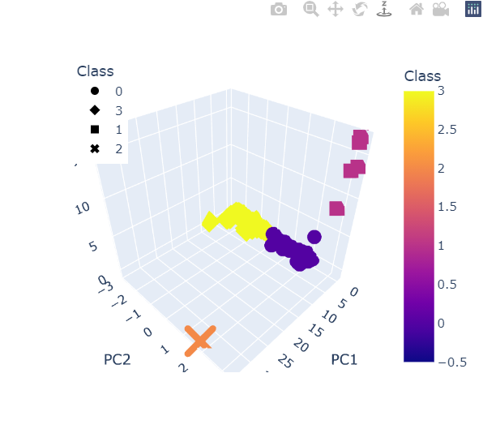
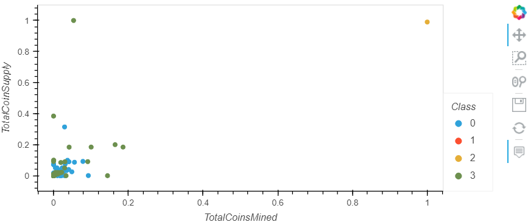

# Cryptocurrencies

## Background 
The cryptocurrency market is booming and is here. This repository is a report of cryto classification groups performed with unsupervised learning. The grouping will be achieved with a clustering algorithm.

## Data Source
* Source data [crypto_data.csv](crypto_data.csv).

This is a simple data set retrieved from [CryptoCompare](https://min-api.cryptocompare.com/data/all/coinlist).

## Data Cleaning
* Extracted data from [crypto_data.csv](crypto_data.csv).

* Utilized python scripts (pandas, numpy) on Jupyter notebook to review and transform data types, removed non-traded cryptocurrencies, removed rows that contain null values and removed the coin names.

## Reducing Data Dimensions Using PCA
* Applied Principal Component Analysis (PCA) algorithm to reduce the dimensions of the DataFrame to three principal components.

## Clustering Cryptocurrencies Using K-means
* Created an elbow curve using hvPlot to find the best values for K from the DataFrame with the three pricipal components. Then, ran the K-means lagorithm to predict the K clusters for the cryptocurrencies' data.

## Data Visualization & Findings
* Created scatter plots with Plotly Express and hvplot. 

* See the interactive plot in [Jupyter notebook](crypto_clustering.ipynb). They are also shown right below.:

* There are 532 tradable cryptocurrencies.

---

## Technical Elements

* Employed Python pandas and numpy skills, and data cleansing methods.

* Performed PCA to then cluster cryptocurrencies using K-means.

* Created scatter plots with Plotly Express and hvplot.

